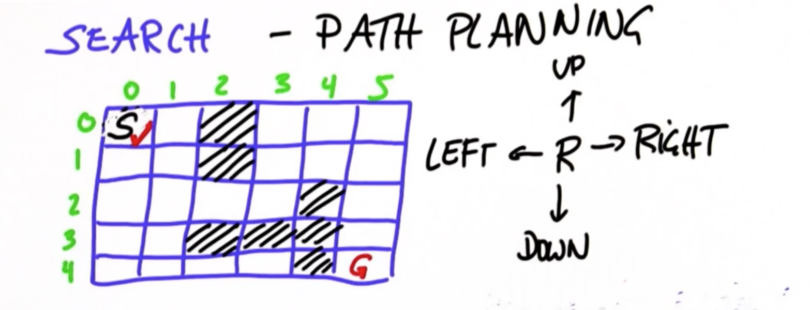
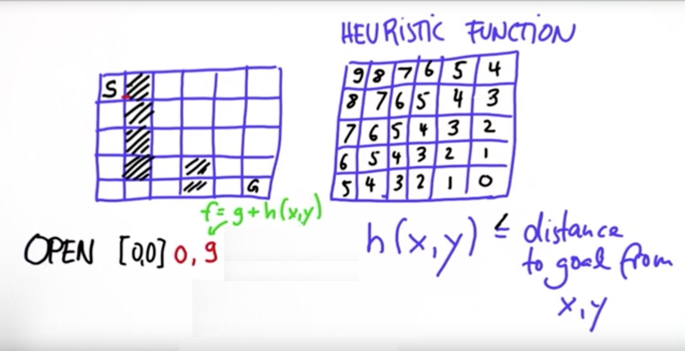

# robot-motion-planning
A python program to plan the motion of a robot. This is simple and basic problem. A robot has to go from start location to an end location in a maze with minimum cost possible. A robot can go left, right, up and down and performing each step costs 1. It can be seen in a picture below.

At the end the program prints the `final path` and `cost` or if it was not able to reach destination then it prints `fail`.

## Using Heuristic Function to Optimize Search

The heuristic function is a way to inform the search about the direction to a goal. It provides an informed way to guess which neighbor of a node will lead to a goal. There is nothing magical about a heuristic function.

As heuristic function gives an estimated guess of distance of current cell from the goal cell so we can use that to improve our search. Now instead of picking cells with minimum cost (also called g-value), we are going to pick cells with minimum f-value (g-value + h(x, y)) where h(x,y) gives the distance from cell (x, y) to goal cell.

